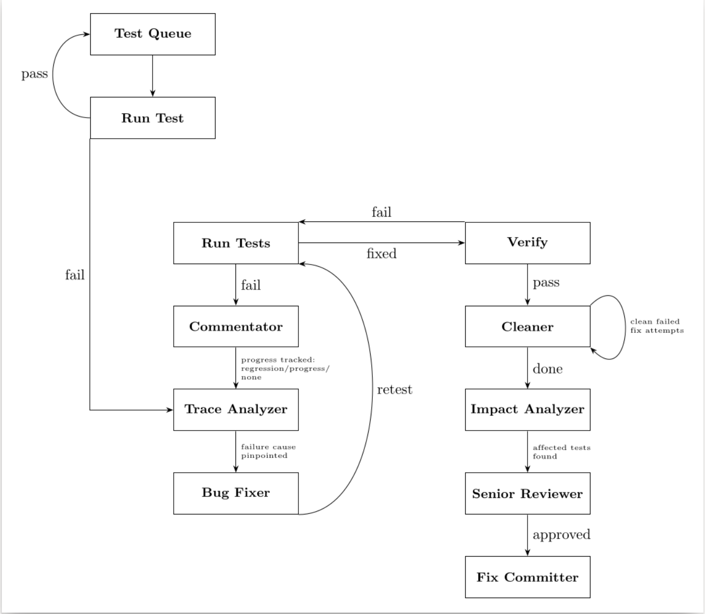

# RootCauseAI

An autonomous AI-powered pipeline that detects test failures, analyzes root causes, generates minimal fixes, validates them through multiple quality gates, and commits the results — all without human intervention.

Built for the [tackle2-ui](https://github.com/konveyor/tackle2-ui) Cypress E2E test suite, but architecturally generalizable to other test frameworks.

---

## Table of Contents

- [How It Works](#how-it-works)
- [Skills (AI Agents)](#skills-ai-agents)
- [Core Modules](#core-modules)
- [Architecture](#architecture)
- [Scripts](#scripts)
- [Artifacts](#artifacts)
- [Directory Structure](#directory-structure)
- [Usage](#usage)
- [Configuration](#configuration)
- [Design Decisions](#design-decisions)

---

## How It Works

RootCauseAI orchestrates **8 specialized Claude AI agents** (called "skills") in a feedback loop:


Each skill is a standalone Claude invocation with its own system prompt, running as a subprocess via the `claude` CLI. Skills communicate through **JSON artifact files** rather than direct API calls, keeping the system loosely coupled and fully auditable.

---

## Skills (AI Agents)

Each skill is a markdown file containing a Claude system prompt. The `SkillRunner` passes these as `--system-prompt` to the `claude` CLI, giving each agent file system access to the target project and artifacts directory.

**Execution order:** commentator → trace-analyzer → bug-fixer → (loop until pass) → cleaner → impact-analyzer → senior-reviewer → fix-committer.

### trace-analyzer

Reads the latest test log from `artifacts/rootcause_logs/` and performs chronological error analysis. The first error in the log is treated as the root cause — later errors (especially in `afterEach`/teardown) are recognized as cascading symptoms. Checks fix history to avoid repeating diagnoses that already failed. Outputs a structured hint with file path, cause description, and recommended fix approach.

**Key constraint:** Never suggests removing test assertions. The application code must be fixed, not the test weakened.

### bug-fixer

Reads the latest hint file and applies a minimal patch. Before writing new helper functions, it searches the project for existing utilities (wait helpers, spinner checkers, etc.). Records every change in diff format. Operates under a strict "change as few lines as possible" philosophy.

### commentator

Compares the current failure to the previous attempt and classifies the outcome:

- **progress** — test fails at a _later_ point than before
- **no_progress** — test fails on the same line
- **regression** — test fails at an _earlier_ point

This diary is fed back to trace-analyzer after 10 failed attempts to help it change strategy.

### cleaner

Only runs after tests pass. Uses `git diff base_commit..HEAD` to identify all code added during the pipeline run. Cross-references the commentator diary to identify code from failed attempts, then removes it. Tests are re-run after each removal. If tests break, the removal is reverted via the tracking file.

### impact-analyzer

Reads the cleaner report to identify kept changes, then traces function usages recursively through the codebase to find every test spec that could be affected. Produces a call-chain graph from changed function to test file.

### senior-reviewer

Final quality gate with three possible outcomes:

1. **Approve** — fix is clean and legitimate
2. **Reject** — fix weakens tests instead of fixing the bug (e.g., removes assertions, adds unconditional waits). Triggers full rollback.
3. **Refactor** — fix works but has code smells (hardcoded timeouts, duplicated logic, missing helper reuse). Applies improvements, reruns tests.

After 2 failed refactoring attempts, it issues a **stopped** decision and keeps the working fix as-is.

---

## Core Modules

### `core/pipeline.py` — Pipeline

The main orchestration class. Manages the fix loop, git branch lifecycle, artifact archival, and coordination between all skills.

**Key constants:**

- `MAX_FIX_ATTEMPTS = 15` — maximum analysis-fix-test iterations
- `MAX_CLEANER_ATTEMPTS = 15` — maximum cleanup iterations

**Git workflow:**

1. Creates a branch from the test name + random suffix
2. Records `base_commit` as the restore point
3. On success: commits via fix-committer skill
4. On failure: `git reset --hard base_commit`
5. On give-up (no fix possible or max attempts): deletes fix branch and checks out original branch

**Verification:** When tests pass after a fix, they're run a second time to catch flaky results. Only after both runs pass does the pipeline proceed to cleanup and review.

### `core/skill_runner.py` — SkillRunner

Builds and executes Claude CLI commands. Maps each skill to its required resources:

| Resource            | Skills that receive it                                                              |
| ------------------- | ----------------------------------------------------------------------------------- |
| Target project path | trace-analyzer, bug-fixer, cleaner, impact-analyzer, senior-reviewer, fix-committer |
| fix_history.json    | trace-analyzer, bug-fixer, cleaner                                                  |
| Commentator diary   | commentator, cleaner                                                                |

**Adaptive behavior:** After 10 failed fix attempts, the last 5 commentator diary entries are appended to the trace-analyzer prompt to help it reconsider its approach.

**CLI command structure:**

```bash
claude \
  --print \
  --model claude-opus-4-5 \
  --add-dir <rootcause_ai_dir> \
  --add-dir <target_project_dir> \
  --system-prompt "<skill markdown content>" \
  "<dynamic prompt with paths and context>"
```

Permissions are managed via `.claude/settings.local.json`

### `core/project_runner.py` — ProjectRunner

Executes the test command (`EXECUTE_COMMAND` or default `npm test`) as a subprocess in the target project directory. Captures combined stdout/stderr to `artifacts/rootcause_logs/run_<timestamp>.log`. Sets `PLAYWRIGHT_TRACE=retain-on-failure` for DOM capture support.

### `core/fix_history.py` — FixHistory

Maintains `artifacts/fix_history.json` with the structure:

```json
{
  "session": "run_2026-01-24_15-30-00",
  "base_commit": "abc123...",
  "attempts": [
    {
      "attempt": 1,
      "cause": "Selector '.submit-btn' not found",
      "fix_applied": "- cy.get('.submit-btn')\n+ cy.get('[data-testid=submit]')",
      "files_changed": ["cypress/e2e/login.cy.ts"],
      "commit_hash": "def456...",
      "result": "failed",
      "error_after": "TimeoutError: element not visible"
    }
  ]
}
```

This file is passed to trace-analyzer and bug-fixer so they avoid repeating failed approaches.

### `core/run_report.py` — RunReport

Appends JSONL entries for real-time progress tracking:

```json
{
  "timestamp": "2026-01-24T15:30:45",
  "skill": "trace-analyzer",
  "event": "reading_log",
  "message": "Analyzing run_2026-01-24.log"
}
```

Supports background tailing via threading — the pipeline shows live skill progress during execution.

### `core/deployer.py` — Deployer

Manages the Kubernetes test environment on minikube:

- `check_minikube()` — verifies cluster is running
- `pull_latest_tests()` — git fetch + rebase + npm install
- `refresh_deployment()` — deletes and recreates the Konveyor CR to pull fresh images
- `start_port_forward()` / `stop_port_forward()` — kubectl port-forward (localhost:9000 -> tackle-ui:8080)
- `run_discovery_tests()` — runs the full E2E suite once, parses JUnit XML for failures

---

## Architecture

```
┌──────────────────────────────────────────────────────────────┐
│                      pipeline.py (CLI)                       │
│                  --nightly | --ft | --full                    │
└──────────────────────┬───────────────────────────────────────┘
                       │
                       ▼
┌──────────────────────────────────────────────────────────────┐
│                  core/pipeline.py                             │
│              Pipeline orchestrator                            │
│                                                              │
│  ┌─────────────┐  ┌──────────────┐  ┌─────────────────────┐ │
│  │ ProjectRunner│  │ SkillRunner  │  │    FixHistory       │ │
│  │ (run tests) │  │ (run claude) │  │ (track attempts)    │ │
│  └─────────────┘  └──────────────┘  └─────────────────────┘ │
│  ┌─────────────┐  ┌──────────────┐                           │
│  │  RunReport  │  │   Deployer   │                           │
│  │  (JSONL)    │  │ (minikube)   │                           │
│  └─────────────┘  └──────────────┘                           │
└──────────────────────┬───────────────────────────────────────┘
                       │ subprocess calls
                       ▼
┌──────────────────────────────────────────────────────────────┐
│                    Claude CLI                                 │
│              claude --system-prompt <skill.md>                │
│                                                              │
│  ┌────────────┐ ┌──────────┐ ┌─────────┐ ┌───────────────┐  │
│  │ trace-     │ │ bug-     │ │ cleaner │ │ senior-       │  │
│  │ analyzer   │ │ fixer    │ │         │ │ reviewer      │  │
│  ├────────────┤ ├──────────┤ ├─────────┤ ├───────────────┤  │
│  │commentator │ │dom-      │ │impact-  │ │fix-committer  │  │
│  │            │ │capturer  │ │analyzer │ │               │  │
│  └────────────┘ └──────────┘ └─────────┘ └───────────────┘  │
└──────────────────────────────────────────────────────────────┘
                       │ reads/writes
                       ▼
┌──────────────────────────────────────────────────────────────┐
│                    artifacts/                                  │
│  hints/ bug_fixes/ rootcause_logs/ dom_snapshots/             │
│  fix_history.json  senior_review.json  impact_analysis.json   │
└──────────────────────────────────────────────────────────────┘
```

---

## Scripts

| Script                              | Purpose                                                                                      |
| ----------------------------------- | -------------------------------------------------------------------------------------------- |
| `get_failing_tests.sh`              | Uses `gh` CLI to download nightly CI artifacts, parses JUnit XML for failing test file paths |
| `copy_cypress_screenshot.sh`        | Copies the latest Cypress screenshot into `artifacts/dom_snapshots/`                         |
| `copy_dom_snapshot.sh`              | Copies Playwright DOM snapshots from the project into artifacts                              |
| `cleanup_dom_snapshots.sh`          | Removes all files from `artifacts/dom_snapshots/` before a test run                          |
| `cleanup_test_resources.sh`         | Kills stale VSCode processes and cleans test data                                            |
| `rename_screenshot_to_match_dom.sh` | Renames screenshot files to match DOM snapshot naming                                        |

---

## Artifacts

All artifacts are written to `artifacts/` (created at runtime). Previous runs are archived to `previous_artifacts/`.

```
artifacts/
├── rootcause_logs/              # Raw test output logs
│   └── run_*.log
├── hints/                       # Root cause analysis (from trace-analyzer)
│   └── hint_*.json
├── bug_fixes/                   # Fix records (from bug-fixer)
│   └── fix_*.json
├── dom_snapshots/               # DOM state + screenshots at failure
│   ├── *.html
│   └── *.png
├── commentator_diary/           # Progress observations
│   └── diary.json
├── cleaner/                     # Code removal tracking
│   └── tracking.json
├── run_reports/                 # JSONL event stream
│   └── run_*.jsonl
├── fix_history.json             # All fix attempts for the session
├── cleaner_report.json          # What was cleaned vs. kept
├── impact_analysis.json         # Affected tests and call chains
└── senior_review.json           # Approve/reject/refactor decision
```

---

## Directory Structure

```
RootCauseAI/
├── pipeline.py                   # CLI entry point
├── .env                          # Environment config (PROJECT_PATH)
│
├── core/                         # Python orchestration modules
│   ├── pipeline.py               # Main loop: test → analyze → fix → verify
│   ├── skill_runner.py           # Builds & executes Claude CLI subprocess calls
│   ├── project_runner.py         # Runs test commands, captures logs
│   ├── fix_history.py            # Tracks every fix attempt as structured JSON
│   ├── run_report.py             # JSONL event stream with real-time tailing
│   └── deployer.py               # Minikube lifecycle & CI failure fetching
│
├── skills/                       # Claude system prompts (one per agent)
│   ├── trace-analyzer.skill.md   # Root cause analysis from logs
│   ├── bug-fixer.skill.md        # Minimal code fix generation
│   ├── commentator.skill.md      # Progress observation diary
│   ├── cleaner.skill.md          # Dead code removal after fix
│   ├── impact-analyzer.skill.md  # Affected test detection
│   ├── senior-reviewer.skill.md  # Quality gate & refactoring
│   └── fix-committer.skill.md    # Git commit creation
│
└── scripts/                      # Shell utilities
    ├── get_failing_tests.sh      # Fetch nightly CI failures via GitHub CLI
    ├── copy_cypress_screenshot.sh
    ├── copy_dom_snapshot.sh
    ├── cleanup_dom_snapshots.sh
    ├── cleanup_test_resources.sh
    ├── rename_screenshot_to_match_dom.sh
    └── test_copy_screenshot.py
```

---

## Usage

### Prerequisites

- Python 3.10+
- `claude` CLI installed and authenticated
- `python-dotenv` and `requests` packages
- Git
- For `--full` mode: minikube with Konveyor deployed, `kubectl`, `gh` CLI

### Run modes

```bash
# Single test (uses EXECUTE_COMMAND from .env, or "npm test" default)
python pipeline.py

# Fetch failures from nightly CI, fix each one
python pipeline.py --nightly

# Use cached failing_tests.json (from a previous --nightly run)
python pipeline.py --ft

# Full cycle: refresh minikube deployment, discover failures, fix all
python pipeline.py --full
```

### Environment variables

| Variable              | Required | Description                                                         |
| --------------------- | -------- | ------------------------------------------------------------------- |
| `PROJECT_PATH`        | Yes      | Relative or absolute path to the target project (Cypress directory) |
| `EXECUTE_COMMAND`     | No       | Test command to run (default: `npm test`)                           |
| `COLLECT_OUTPUT_LOGS` | No       | Set to `true` to copy test output logs                              |
| `OUTPUT_LOG_NAME`     | No       | Filename pattern for output logs                                    |

---

## Configuration

### `.env` file

```env
PROJECT_PATH=../../cypress
```

### Kubernetes (hardcoded in deployer.py)

| Setting           | Value                                   |
| ----------------- | --------------------------------------- |
| Namespace         | `konveyor-tackle`                       |
| Port forward      | `localhost:9000 -> tackle-ui:8080`      |
| Image pull policy | `Always` (forces fresh pull on refresh) |

---

## Design Decisions

### Why artifacts instead of in-memory state?

Each Claude skill runs as a separate subprocess. Artifacts (JSON files) are the natural IPC mechanism — they're human-readable, debuggable, and persist for post-mortem analysis. If the pipeline crashes, all intermediate state is recoverable.

### Why separate skills instead of one big prompt?

Each skill has a focused responsibility and a constrained system prompt. This prevents context pollution (the fixer doesn't need to know how to review) and keeps token usage per invocation manageable. Skills can also be developed, tested, and iterated independently.

### Why verification runs?

A fix that passes once might be flaky. Running tests a second time after the fix catches timing-dependent false positives before committing.

### Why a senior reviewer?

Without a quality gate, the system could "fix" tests by weakening assertions (removing checks, adding unconditional waits). The senior reviewer specifically checks for this pattern and rejects illegitimate fixes.

### Why a cleaner?

During multi-attempt loops, earlier failed fixes may leave behind dead code (unused imports, abandoned helper functions, debug waits). The cleaner removes these incrementally, re-testing after each removal.

### Why track fix history?

Both trace-analyzer and bug-fixer receive the full history of past attempts. This prevents the system from entering infinite loops where it keeps trying the same failed approach.

### Why commentator diary?

After many failed attempts, the trace-analyzer may be stuck in a local optimum. The diary provides a high-level view of what's been tried and whether progress is being made. After 10 failures, the last 5 diary entries are injected into the trace-analyzer prompt to encourage a strategy change.

### Why limit diary access?

The commentator diary is only shared with cleaner (which needs it to identify dead code from failed attempts) and trace-analyzer (after 10 failures). Other agents don't see it to avoid tunnel vision — too much context about past attempts can cause agents to overthink instead of solving the problem fresh.
